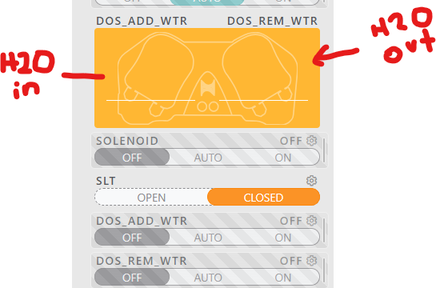

# Apex Fusion Application

You can find the Apex Fusion application in the Apple store. 

When you login and open it you will get this screen.

## Feeding

When you need to feed you hit the Feed Cycle A button.  That will turn off all the equipment for 15 minutes.  After the cycle is over all equipment will be automatically turned on. 

## Apex Measurements

Tmp, Salt, PH and ORP are constantly measured.  If any of these go below a threshold I will get an alarm.

The Trident is a device that uses a solution which measures the Alkalinity, Calcium and Magnesium.  It runs 2 times a day. 

It is not accurate.  I compare the Trident to other measurements and then figure out the offset.  

The range I want is

- ALK 8-8.5
- CA 400-450
- MG 1300-1350

These ranges allow for fluctiations outside the range. 

## Pump

The Pump is a Cor-20.  To turn it off you use the switch.  The Pump is a key element of the tank that ensures good flow.

## Water Changes

I change 10% of the tank water volume each week.

Water changes are daily and automatic.  .  Each day starting at 13:00 the pumps start adding and removing water. You will hear the pump running.  The pump does not run constantly but changes the water in increments.

You will see the volume of water changed in the pump screen.  It is currently empty because i need to mix a new batch of salt.

When the 

come back to this

## Dosing

I keep the PH between 7.8-8.2.  If the PH gets too low I can raise it by dosing Kalkwasser.  

If the Alkalinity gets too low I can raise it by dosing Sodium BiCarbonate. 

I can control how much I dose by adjusting in these screens.

## Powering Equipment

You can manually power off equipment in the Apex application. 

The main ones I use are:
- RF_Light which turns the Sump Light on and off so I check the sump
- SKIM which turns the Skimmer on and off so I can clean it

