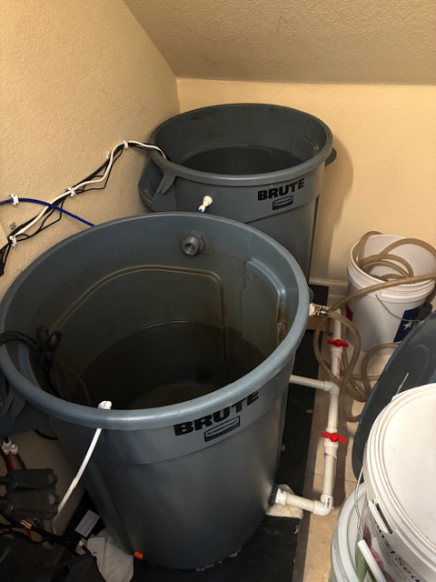
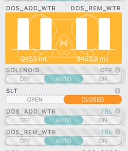

# Mixing New Salt Water

The mixing station is under the stairs. In the back is the trash can that holds the fresh water. This water goes through our filtration system to remove any impurities.

The front trash can holds the salt water.  The water is automatically pulled from the salt water trash can and put in the tank during the automatic water changes.

The Apex has pumps that add new salt water and removes salt water.  The water changes start at 13:00 daily and the Apex shows the volume of water added and removed.

When the SLT switch goes from closed to open the salt water in the trash can is low and the water changes will stop.

## Steps to Mix New Salt Water

1. Ensure the fresh water bucket is full

    To fill it turn the solenoid to On. 

    

    This will open the solenoid(the white box) that allows the water to flow into the bucket. You will hear the water flowing through the purification system into the bucket.
    

    When the bucket is full a manual stop will prevent it from overflowing.  

    Once full move on to the next step

    