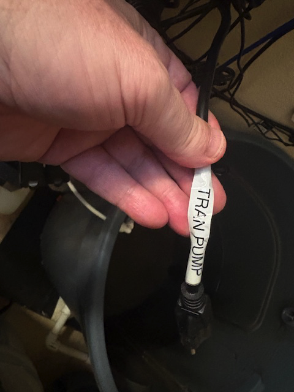
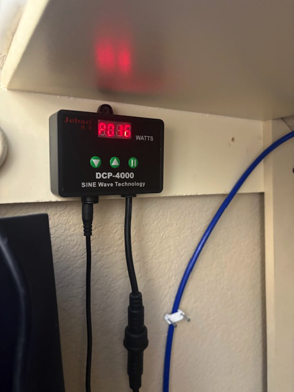
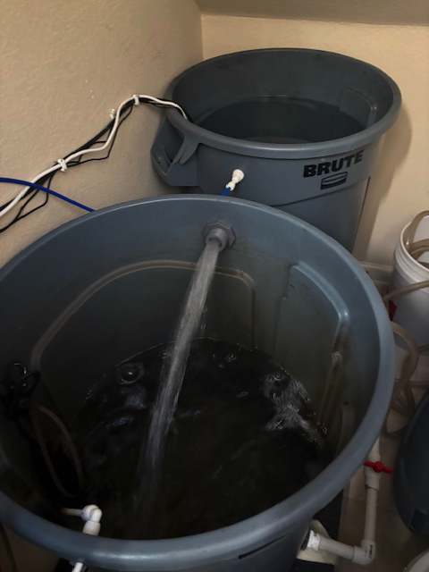
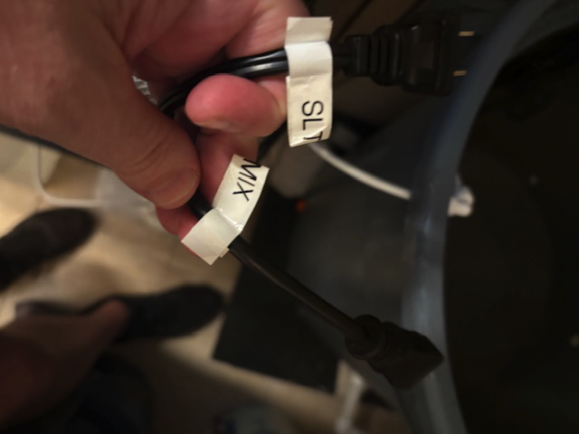
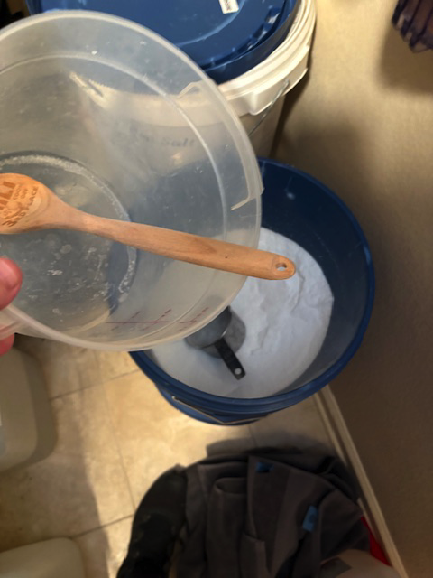
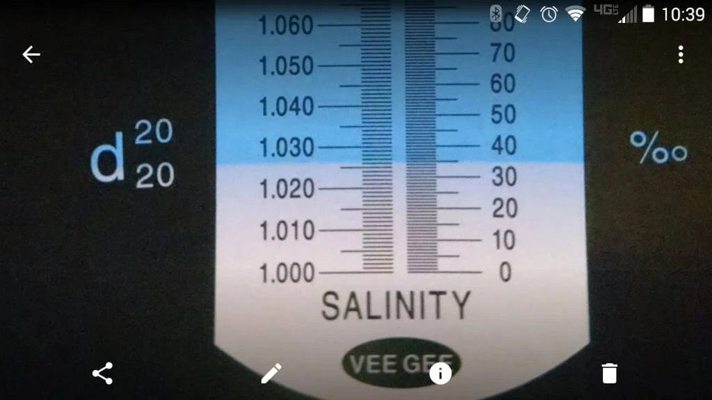

# Mixing Salt Water

The mixing station is under the stairs. In the back is the trash can that holds the fresh water. This water goes through the RODI filtration system before it is put into the bucket.

The front trash can holds the salt water.  This salt water is used by the daily automatic water change.

The Apex has pumps that add new salt water and removes salt water.  The water changes start at 13:00 daily. The Apex shows the volume of water added and removed. 

When the SLT switch goes from CLOSED to OPEN the new salt water needs to be mixed. 

## How to Mix New Salt Water

1. Ensure the fresh water trash can is full

    To fill it turn the Solenoid switch to On. 

    

    This will open the solenoid(the white box) which will allow water to flow into the bucket. 
    

    You will hear the water flowing through the purification system into the bucket. When the bucket is full a manual stop will prevent it from overflowing.  

    Once full move on to the next step

2. Transfer the fresh water to the salt water bucket

    Turn the red valve to the left.  This allows fresh water to flow between the trash cans. 

    

    Plug the transfer pump electric cord into one of the 3 prong outlets.

    

    The pump will come on and water will start flowing.

    

    

    When the water gets close to the water exit pipe unplug the cord.

    Close the red value by turning it to the right.

3. Plug in the water heater and mixing pump into the 3 prong outlet   

    

4. Add salt to the water

   Open the salt bucket and put 12 cups of salt into the plastic mixing container. 

   
   
   Put the plastic mixing container in the water and use the wood spoon to mix the salt in the plastic mixing container until it is dissolved.  Once dissolved mix with the water in the trash can.
   
   Use the refractometer to test the salinity. You want to get to 35ppm on the refractometer. To do that I usually add 1 or 2 cups of more salt.
   
 
   
5. Unplug the plugs for the mixing pump and heater 

6. Verify the SLT switch is on CLOSED 

    

7.  Turn the SOLENOID switch to AUTO   

    

   