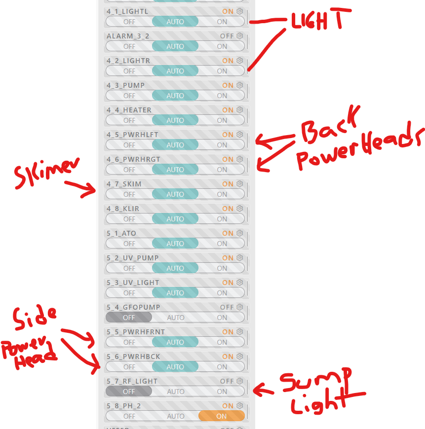

# Cleaning the Protein Skimmer

The Skimmer removes organic waste and helps oxygenate the water.  It works by creating foam, which attracts adn concentrates disolved organic compounds, like fish waste and uneaten food, then removes this foam from the system.

The Skimmer needs to be emptied regularly to prevent overflow.

If the Skimmer black liquid gets close to the red line you need to clean it.

Steps to clean:

1. Turn it off

    Open the app and turn the 4_7_SKIM switch to off
    

2. Remove the clear container

3. Take it to the sink and wash it with water(no soap)

4. Put it back together

5. Put the clear container back on